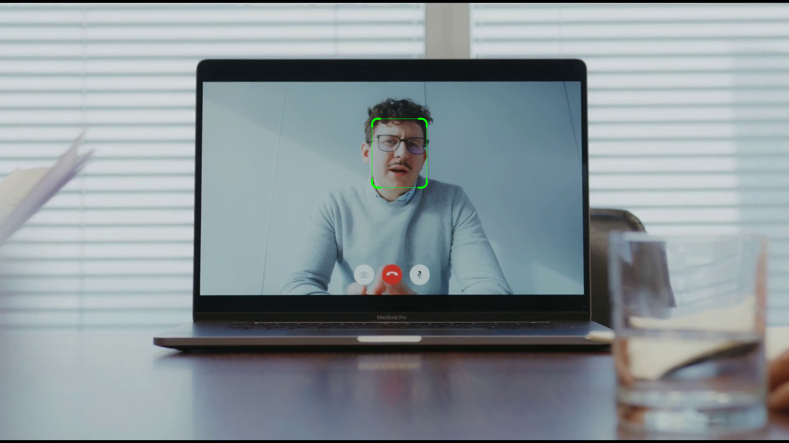
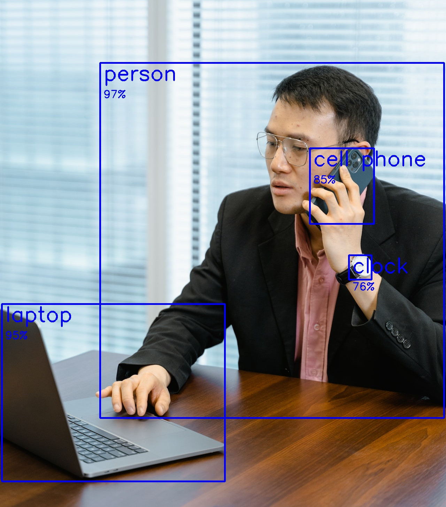

<p align="center">
  <h1 align="center">MeetingCam</h1>
  <p align="center">&#x2728 Special effects for not so special meetings. &#x1F440</p>
</p>
<hr />
<p align="center">
    AI webcam utility for online meetings. Run your AI in online Meetings such as Zoom, Meets or Teams! &#x1FA84;
    </br> This repo is <i>work in progess</i>. The current version is a command line tool for Linux.
</p>
<hr />

https://github.com/nengelmann/MeetingCam/assets/120744129/ec2e608d-e785-4179-ba33-c692da05a95b

## Installation

0. Clone this repo

   ```bash
   git clone https://github.com/nengelmann/MeetingCam.git && cd MeetingCam
   ```

1. Install [virtualenv](https://virtualenv.pypa.io/en/stable/installation.html)

2. Create a virtual python3.10 environment
   ```bash
   virtualenv -p /usr/bin/python3.10 .venv && source .venv/bin/activate
   ```
3. Install the dependencies
   ```bash
   python -m pip install -r requirements.txt
   ```
4. Setup [pyvirtualcam](https://github.com/letmaik/pyvirtualcam)
   ```bash
   sudo apt install v4l2loopback-dkms
   sudo apt install v4l-utils
   ```
5. Download model, convert model and opt out from sending usage data
   ```bash
   omz_downloader --name ultra-lightweight-face-detection-rfb-320 --output_dir src/meetingcam/models
   omz_converter --name ultra-lightweight-face-detection-rfb-320 --download_dir src/meetingcam/models --output_dir src/meetingcam/models --precision=FP16
   opt_in_out --opt_out
   ```
   More about the used face detection model can be found [here](https://github.com/openvinotoolkit/open_model_zoo/blob/master/models/public/ultra-lightweight-face-detection-rfb-320/README.md).
   A very light weight model will just work fine, due to the easy task of face detection of a person in front of a webcam.

## Usage

1. Make sure your web cam is connected.

2. Activate the virtual environment
   ```bash
   source .venv/bin/activate
   ```
3. Run the main.py to get custom instructions on how to create virtual cameras with your web cam. \
   A virtual camera is needed to stream the modified camera images to your meeting tools like teams, zoom or meets.

   ```bash
   python ./src/meetingcam/main.py
   ```

   Don't be confused, you'll need to add your camera with another (sudo) bash command like `sudo modprobe v4l2loopback devices=1 video_nr=0 card_label="MeetingCam0"`. \
   The main.py file will provide more info on how this command needs to be for your system/camera.

4. After you added your virtual device or devices, run the main.py again.

   ```bash
   python ./src/meetingcam/main.py
   ```

   In the terminal you'll then see which command you need to run for your specific camera setup. \
   It should look like:

   _For YOUR CAMERA DEVICE run:_ \
   _'python src/meetingcam/main.py --device-path /dev/videoX --name YourName'_

   **Enter your** camera **command** and start MeetingCam

If you **restart** your system, it **will** unload the module and **undo the above device setup** \
You can also run `sudo modprobe -r v4l2loopback` to undo the device setup.

## Face Detection Example

The default and current only webcam AI-Plugin is the Face Detection example.

You'll run it with main.py as described under the usage section. \
`python src/meetingcam/main.py --device-path /dev/videoX --name YourName`

It will make a virtual camera available in your meeting tools. You join a meeting, select the virtual camera e.g. 'MeetingCamX CameraName'.
By default it will show an unmodified camera stream of your real camera.


Let's press **<Ctrl+Alt+f>** for detection of your face!


You can now show your name with **<Ctrl+Alt+n>**.


_Actually your face is already detected the hotkey command just enables the print in of the detection._

## Depthai Yolov5 Example

The default and current only depthai AI-Plugin is a yolov5 model trained on the COCO dataset.

You'll run it with main.py as described under the usage section. \
`python src/meetingcam/main.py --device-path /dev/videoX --depthai`

It will make an depthai OKA device as virtual camera available in your meeting tools. You join a meeting, select the virtual camera.
By default it will show an unmodified camera stream of your real camera.


Let's press **<Ctrl+Alt+h>** for unhiding the camera detections! \


In this example, the neural network runs directly on the OAK camera, not on your PC.

## Switches

There are two switches build in. They allow you to switch the image color channel from BGR to RGB and to mirror the video stream.
The main purpose is that if your camera is outputting an RGB stream by default you would look bluish, you can switch without modifying the code. Also the mirroring is helpful in some setups.

**<Ctrl+Alt+r>** -> Switch color channels (RGB<>BGR). \
**<Ctrl+Alt+m>** -> Mirror the video stream.

## Further information

### Restrictions

**Resolution**
In general most meeting tools have the restriction on camera/video resolution, mostly 720p (1270x720 pixels). Make sure to not send a virtual video stream with higher resolution. If it breaks due to resolution you can select the virtual camera in the meeting tool but it will either show "Camera failed" or a black video stream.

**Chrome/Chromium Browser**
Chrome/Chromium might need to be ran with 'exclusive_caps=1' in the 'sudo modprobe v4l2loopback' command which is not (yet) supported by MeetingCam.

### Tool compatibility

#### Meets ✅

Works on Firefox.

#### Zoom ✅

Works on Firefox.

#### Teams 🚧

There are several Problems running MeetingCam on Linux with Teams. \
Teams, at least on Linux is just running on Chromium, Edge and it's Progressive Web App (PWA). Therefore we need to run the 'sudo modprobe v4l2loopback' command with 'exclusive_caps=1' argument, which makes troubles down the road. For some cameras this might work but is likely to fail. Even with the 'exclusive_caps=1' argument it is not reliably working. \
A **workaround** is described [here](https://medium.com/@dan_ringwald/make-microsoft-teams-work-on-linux-with-firefox-browser-867fa0485ac). On Firefox Version 117.0.1 (snap install) it was working with the overwrite 'Mozilla/5.0 (Windows NT 10.0; Win64; x64) AppleWebKit/537.36 (KHTML, like Gecko) Chrome/79.0.3945.74 Safari/537.36 Edg/79.0.309.43'. This overwrite might cause unwanted behaviour (including Google Meets calls are failing). So it is advisable to not add the overwrite in your main firefox profile. However you can run 'firefox -p' and create a new dedicated profile and apply the above changes. Then you can open it with 'firefox -p' or 'firefox -P PROFILE_NAME' and run it isolated.

### Camera setup info

More information on how to setup virtual cameras can be found [here](https://wiki.archlinux.org/title/V4l2loopback)

### Development and modifications

You can customize this repo for your needs, you can also write your own AI-Plugin for running your models on Zoom, Teams or Meets. \
More information about that in [DEVELOP.md](DEVELOP.md)

### Usage with depthai camera

#### Install additional dependencies

```bash
 source .venv/bin/activate
 pip install depthai
```

#### Run OAK devices as webcam (uvc)

Run OAK devices as uvc before normal usage of MeetingCam.

```bash
 source .venv/bin/activate
 python ./tools/oak_as_uvc.py
```

#### Run OAK devices with on device compute

Follow the steps in the [Usage](#Usage) section normally, just append a '--depthai' flag.

```bash
 source .venv/bin/activate
 python src/meetingcam/main.py --depthai
```
