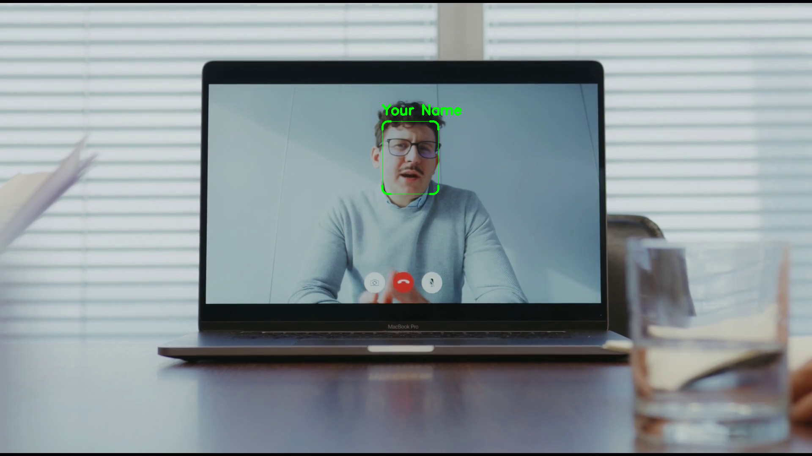

<p align="center">
  <h1 align="center">MeetingCam</h1>
  <p align="center">&#x2728 Special effects for not so special meetings. &#x1F440</p>
</p>
<hr />
<p align="center">
    Run your AI and CV algorithms in online meetings such as Zoom, Meets or Teams! &#x1FA84;
    </br></br>This repo is <i>work in progess</i>. The current version is a command line tool for Linux.
</p>
<hr />

https://github.com/nengelmann/MeetingCam/assets/120744129/ec2e608d-e785-4179-ba33-c692da05a95b

[First-person face detection](src/meetingcam/plugins/openvino_face_detection/README.md) prints your face detection and name in your webcam stream. \
More plugins are listed further down the readme. 

## Installation

1. Clone this repo

   ```bash
   git clone https://github.com/nengelmann/MeetingCam.git && cd MeetingCam
   ```

2. Install [virtualenv](https://virtualenv.pypa.io/en/stable/installation.html)

3. Create a virtual python3.10 environment
   ```bash
   virtualenv -p /usr/bin/python3.10 .venv && source .venv/bin/activate
   ```
4. Install the dependencies
   ```bash
   python -m pip install -r requirements.txt
   ```
5. Setup [pyvirtualcam](https://github.com/letmaik/pyvirtualcam)
   ```bash
   sudo apt install v4l2loopback-dkms
   sudo apt install v4l-utils
   ```
## Usage

### First add a camera device to MeetingCam

To show a modified camera stream in online meetings it is necessary to create a virtual camera for each real camera you want to use.

1. Make sure your webcam is connected.

2. Activate the virtual environment
   ```bash
   source .venv/bin/activate
   ```
3. Run the main.py to see general commands and plugin options.
   ```bash
   python ./src/meetingcam/main.py
   ```
4. List available cameras
   ```bash
   python src/meetingcam/main.py list-devices
   ```
5. Get command to add a camera device
   ```bash
   python src/meetingcam/main.py add-devices
   ```
   Then **copy and execute** the **command of the camera you want to use**.
6. You can now see that the camera of your choice has a virtual counterpart.
   ```bash
   python src/meetingcam/main.py list-devices
   ```

### Run a plugin

The general command to run a plugin is:
```bash
python src/meetingcam/main.py PLUGIN_NAME [OPTIONS] DEVICE_PATH
```

e.g. the face detection plugin:
```bash
python src/meetingcam/main.py face-detector --name yourname /dev/video0
```

Options and usage for each plugin are documented in the plugins help function \
and in it's readme (link below 👇)

## Available plugins
### [**first-person face detector**](src/meetingcam/plugins/openvino_face_detection/)
[](src/meetingcam/plugins/openvino_face_detection/)  \
Detection of first persons face and imprint of bounding box with name.

### [**roboflow general**](src/meetingcam/plugins/roboflow_general/)
[](src/meetingcam/plugins/roboflow_general/) \
 Runs roboflow object-detection and instance-segmentation models.

### [**depthai yolov5**](src/meetingcam/plugins/depthai_yolov5_coco/)
[](src/meetingcam/plugins/depthai_yolov5_coco/) \
Runs a Yolov5 model trained on COCO. Computation on a depthai device.

## Custom plugins

You can create custom plugins. Have a look in [src/meetingcam/plugins](src/meetingcam/plugins) and see how the existing plugins are implemented.
1. Duplicate one of the plugins directory and rename the directory.
2. The only relevant file is `plugin.py` in which you need to adapt the following:

   - Variable: name, short_description, description
   - Variable TYPE, which can be WEBCAM (normal case) or DEPTHAI
   - The plugin class which inherited from BasePlugin. This class needs to have an `init` and `process` function, for initialization and processing of a camera images respectively.
   
      ```python
      class YourPluginClass(PluginBase):
      
         def __init__(self, your_arg) -> None:
            super().__init__()
            # some more custom init, e.g. your AI model
            self.your_arg = your_arg
            self.model = YourModel()

         def process(
            self,
            image: NDArray[Any],
            detection: Any,
            trigger: tuple[bool, bool, bool],
         ) -> NDArray[Any]:
            # custom image processing
            image = self.model(image, your_arg)
            cv2.putText(image,"That's printed in every frame!", (10,10), cv2.CV_FONT_HERSHEY_SIMPLEX, 2, 255)
            return image
      ```
   - Last step is to define your plugins entry point (typer app), simply adapt to your needs.
      ```python
      @plugin_app.callback(rich_help_panel="Plugin-Commands")
      def main(
         device_path: DevicePath = DevicePathWebcam,
         your_arg: Optional[str] = typer.Option(
            default=None, help="Your custom argument."
         ),
      ):
         # instantiate your plugin
         plugin = YourPluginClass(your_arg)
         # instantiate runner with plugin and device path
         runner = Runner(plugin, device_path)
         # run
         runner.run()
      ```

There is an even easier way to setup custom plugins on the roadmap, stay tuned!

## Switches and triggers

There are two **switches** build in. They allow you to switch the image color channel from BGR to RGB and to mirror the video stream.
The main purpose is, that if your camera is outputting an RGB stream by default you would look bluish, you can switch without modifying the code. Also the mirroring is helpful in some online meeting tools.

**<Ctrl+Alt+r>** -> Switch color channels (RGB<>BGR). \
**<Ctrl+Alt+m>** -> Mirror the video stream.

Plugins can use additional triggers within their processing function. This is useful to hide some imprints or run the model when needed. See the plugins readmes for more information. 

## Further information

### Restrictions

**Resolution** \
In general most meeting tools have the restriction on camera/video resolution, mostly 720p (1270x720 pixels). Make sure to not send a virtual video stream with higher resolution. If it breaks due to resolution you can select the virtual camera in the meeting tool but it will either show "Camera failed" or a black video stream.

**Chrome/Chromium Browser** \
Chrome/Chromium might need to be ran with `exclusive_caps=1` in the `sudo modprobe v4l2loopback` command which is not (yet) supported by MeetingCam.

### Tool compatibility

#### Meets ✅

Works on Firefox.

#### Zoom ✅

Works on Firefox.

#### Teams 🚧

There are several Problems running MeetingCam on Linux with Teams. \
Teams, at least on Linux is just running on Chromium, Edge and it's Progressive Web App (PWA). Therefore we need to run the `sudo modprobe v4l2loopback` command with `exclusive_caps=1` argument, which makes troubles down the road. For some cameras this might work but is likely to fail. Even with the `exclusive_caps=1` argument it is not reliably working. \
A **workaround** is described [here](https://medium.com/@dan_ringwald/make-microsoft-teams-work-on-linux-with-firefox-browser-867fa0485ac). On Firefox Version 117.0.1 (snap install) it was working with the overwrite `Mozilla/5.0 (Windows NT 10.0; Win64; x64) AppleWebKit/537.36 (KHTML, like Gecko) Chrome/79.0.3945.74 Safari/537.36 Edg/79.0.309.43`. This overwrite might cause unwanted behaviour (including Google Meets calls are failing). So it is advisable to not add the overwrite in your main firefox profile. However you can run `firefox -p` and create a new dedicated profile and apply the above changes. Then you can open it with `firefox -p` or `firefox -P PROFILE_NAME` and run it isolated.

### Camera setup info

More information on how to setup virtual cameras can be found [here](https://wiki.archlinux.org/title/V4l2loopback)

### Development and modifications

You can customize this repo for your needs, you can also write your own AI-Plugin for running your models on Zoom, Teams or Meets. \
More information about that in the section [Custom plugins](#custom-plugins) section and in [DEVELOP.md](DEVELOP.md)
Templates and documentation on how to run your custom AI will follow.

### Usage with depthai camera

#### Run OAK devices as webcam (uvc)

Run OAK devices as uvc before normal usage of MeetingCam.

```bash
 source .venv/bin/activate
 python ./tools/oak_as_uvc.py
```

#### Run OAK devices with on device compute

Follow the steps in the [Usage](#Usage) section normally, just append a `--type depthai` flag to the `list-devices` and `add-devices` command and use a plugin which is of type depthai.

```bash
 python src/meetingcam/main.py list-devices --type depthai
 python src/meetingcam/main.py add-devices --type depthai
```

### Usage with Roboflow

For roboflow it is currently needed to run a roboflow inference server in a separate terminal.

You can run it e.g. on CPU with the following command:
```bash
docker run --net=host roboflow/roboflow-inference-server-cpu:latest
```
See [here](https://github.com/roboflow/inference) for more options.